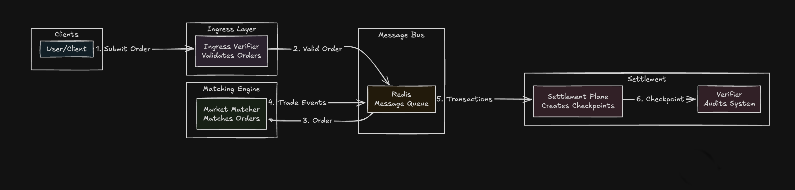
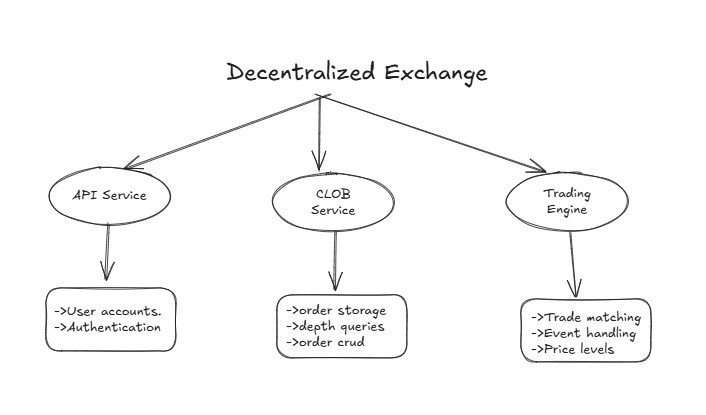

# Exchange Platform

A modular cryptocurrency exchange built in Rust. Think of it as three separate services working together - user management, order book, and trade matching.

## Exchange



## What's Inside



## The Three Services

**API Service** - Handles user accounts and authentication. Built with Actix Web and PostgreSQL.

**CLOB Service** - Manages the order book in memory. Users can create, delete orders and check market depth.

**Trading Engine** - The brain that matches buy and sell orders. Uses BTreeMap for fast price-time priority matching.

## Why Rust?

This isn't just another exchange. The choice of Rust gives us memory safety without garbage collection, which is crucial for financial systems. No data races, no null pointer exceptions, and performance that rivals C++.

The order matching engine uses BTreeMap for O(log n) operations and VecDeque for FIFO matching within price levels. Everything is thread-safe with Arc<Mutex<>> where needed.

## Getting Started

```bash
# API service
cd api && cargo run

# Order book service
cd clob && cargo run

# Test the matching engine
cd clobv2/engine && cargo test
```

## Architecture Philosophy

Each service is independent. You can scale them separately, deploy them on different machines, or even rewrite one without touching the others. The API service talks to PostgreSQL, the CLOB service keeps orders in memory for speed, and the trading engine focuses purely on matching logic.

This modular approach makes it easier to add features like WebSocket updates, Redis for distributed order books, or even Solana integration for on-chain settlement.
